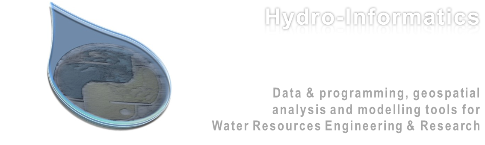

.. Hydro-Informatics documentation master file, created by
   sphinx-quickstart on Wed Mar 17 17:20:33 2021.
   You can adapt this file completely to your liking, but it should at least
   contain the root `toctree` directive.

.. |br| raw:: html

   

Welcome
=======

Large datasets, such as airborne imagery and hydro-meteorological
datasets collected worldwide, drive progress in many disciplines. With
traditional spreadsheet analysis tools, however, the large amounts of
data can hardly be analyzed, understood, or used. The courses supported
with this website aid hydraulic engineers, geomorphologists, river
ecologists, and any water resources related challenge with tools for
efficient data analyses and presentation. The methods described rely on
open-access tools to leverage international and interdisciplinary
collaboration on all levels.

.. note::
  The term hydroinformatics (or hydro-informatics) is widely used in relation to the field of hydrology.

  Yet, the syllable *hydro* goes back to the Greek word for *water*. In this light the term *hydro-informatics* as used on this website also refers to water, but primarily in the field of hydraulic engineering with its links to ecohydraulics, geomorphology, geo-informatics, and hydrology.

Contents
========

Find your course in the `Classroom <hy_lecture_index.html>`__ chapter
(`lectures and exercises <hy_assignments.html>`__) and take a seat.

The *Get started* chapter represents a summary of provide systematic
workflows to setup your computer for: - coding with `Python
Anaconda <hy_ide.html>`__ - code documentation with
`markdown <hy_documentation.html>`__ - version control with
`git <hy_git.html>`__ - geospatial analyses with `desktop
applications <geo_software.html>`__ such as *QGIS* - using `auxiliary
tools and open-source/access alternatives <hy_others.html>`__ to
proprietary software such as *GNU Octave* (similar to *Matlab*) or
*Libre Office* (similar to MS Office)

The *Python* chapters provide: - a general introduction to *Python*
programming and object orientation (`basics <python.html>`__); - an
overview of `geospatial data and analyses with
Python <geo-python.html>`__.

The numerical modelling chapter provides complete workflows for getting
started with two-dimensional (2D) hydrodynamic models: - `ETH Zurich\ ’s
BASEMENT <bm.html>`__ software - More in the future

The `Troubleshooting <dbg_anaconda.html>`__ chapter includes information
about how to debug known issues (not that issues ever existed…).

.. toctree::
   :maxdepth: 2
   :caption: Contents:

.. toctree::
   :maxdepth: 1
   :caption: Classroom

   lectures/classroom
   lectures/lectures
   lectures/take_seat

.. toctree::
   :maxdepth: 1
   :caption: Software

   get-started/vm
   get-started/ide
   get-started/git
   get-started/documentation
   get-started/geo
   get-started/install-openfoam
   get-started/install-telemac
   get-started/others

.. toctree::
   :maxdepth: 2
   :caption: Python (basics)

   python-basics/pyintro
   python-basics/pyinstall
   python-basics/pybase
   python-basics/pyerror
   python-basics/pyloop
   python-basics/pyfun
   python-basics/pypckg
   python-basics/pynum
   python-basics/pyplot
   python-basics/pystyle
   python-basics/classes
   python-basics/xml
   python-basics/gui

.. toctree::
   :maxdepth: 2
   :caption: Python (geo)

   geopy/geo-python
   geopy/geospatial-data
   geopy/geo-pckg
   geopy/geo-shp
   geopy/geo-raster
   geopy/geo-convert

.. toctree::
   :maxdepth: 2
   :caption: Python Exercises

   python-exercises/exercises
   python-exercises/ex-git
   python-exercises/ex-ms
   python-exercises/ex-sp
   python-exercises/ex-floods
   python-exercises/ex-sediment
   python-exercises/ex-gui
   python-exercises/ex-geco

.. toctree::
   :maxdepth: 2
   :caption: Numerical Modelling

   numerics/about-numerics
   numerics/pre-qgis
   numerics/bm
   numerics/tm-about
   numerics/tm2d
   numerics/tm3d

.. toctree::
   :maxdepth: 2
   :caption: Troubleshooting

   troubleshooting/anaconda
   troubleshooting/basement
   troubleshooting/dbg-jupyter
   troubleshooting/linux
   troubleshooting/numerical-models
   troubleshooting/python
   troubleshooting/telemac
   troubleshooting/vm-dbg

.. toctree::
   :maxdepth: 2
   :caption: Terms and Conditions

    terms/disclaimer
    terms/license

Indices and tables
==================

* :ref:`genindex`
* :ref:`modindex`
* :ref:`search`
