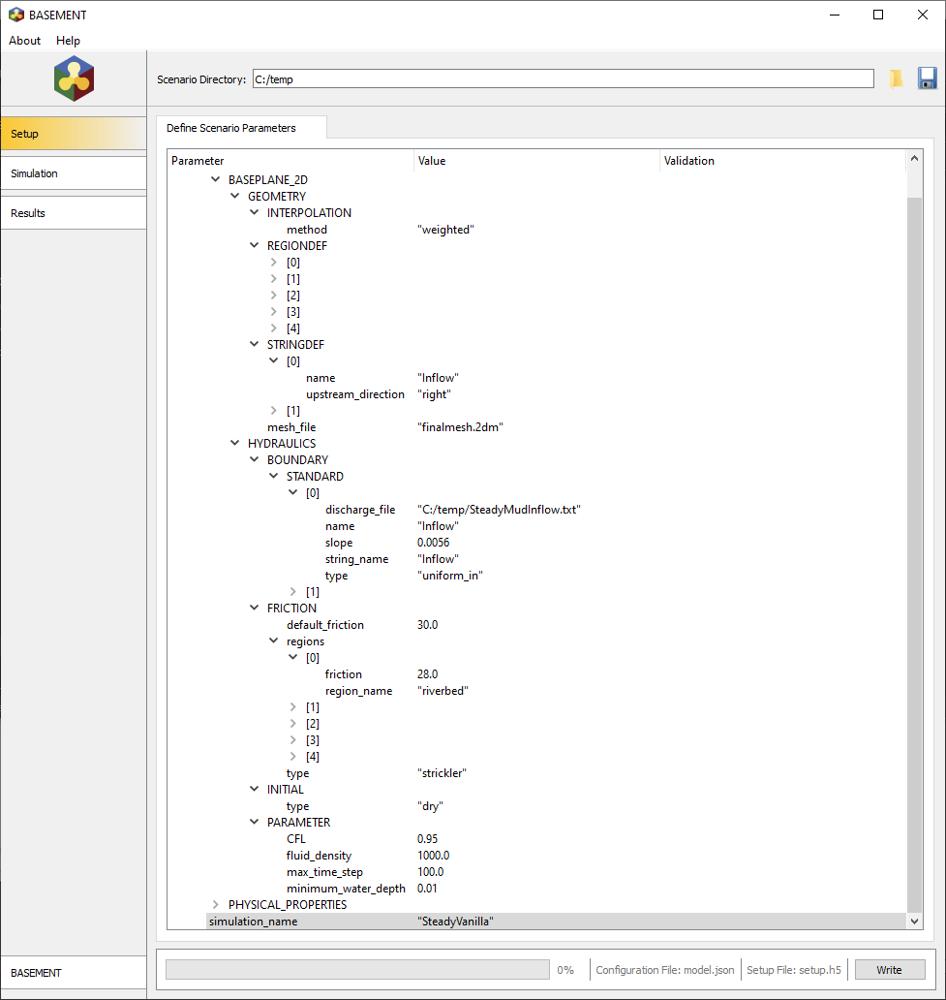
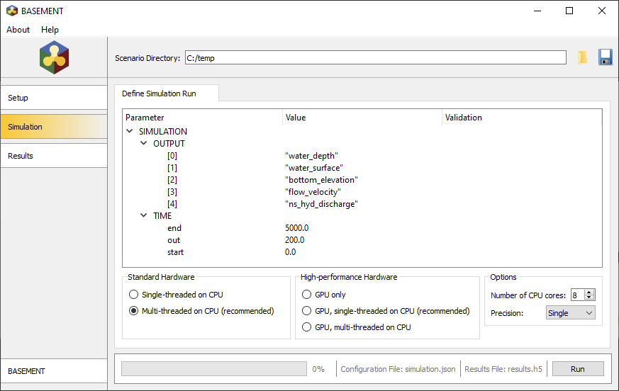
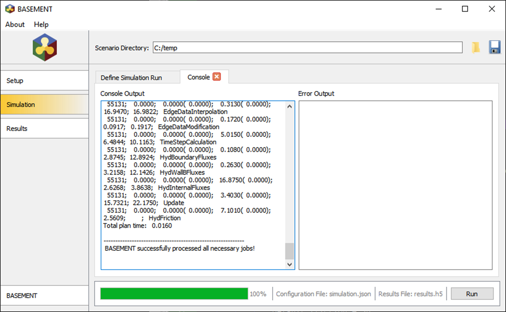
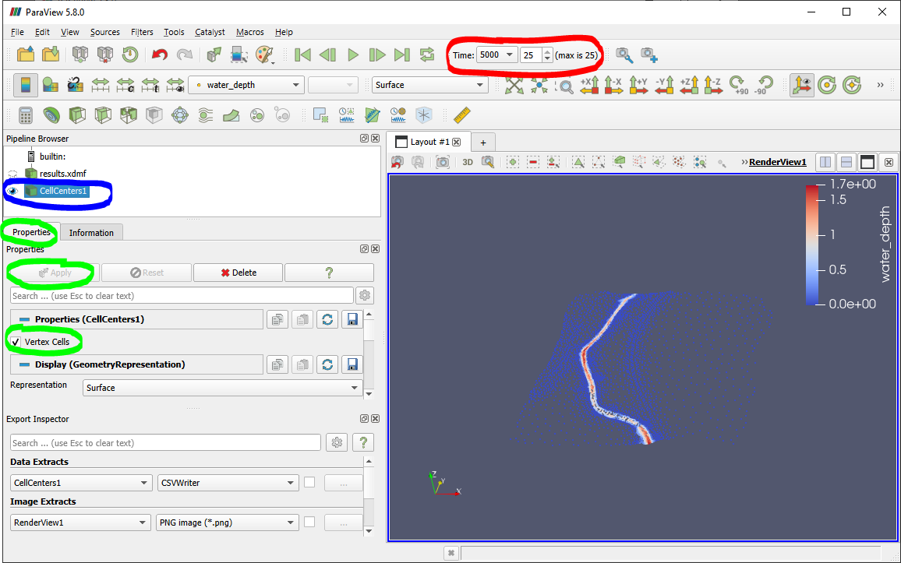
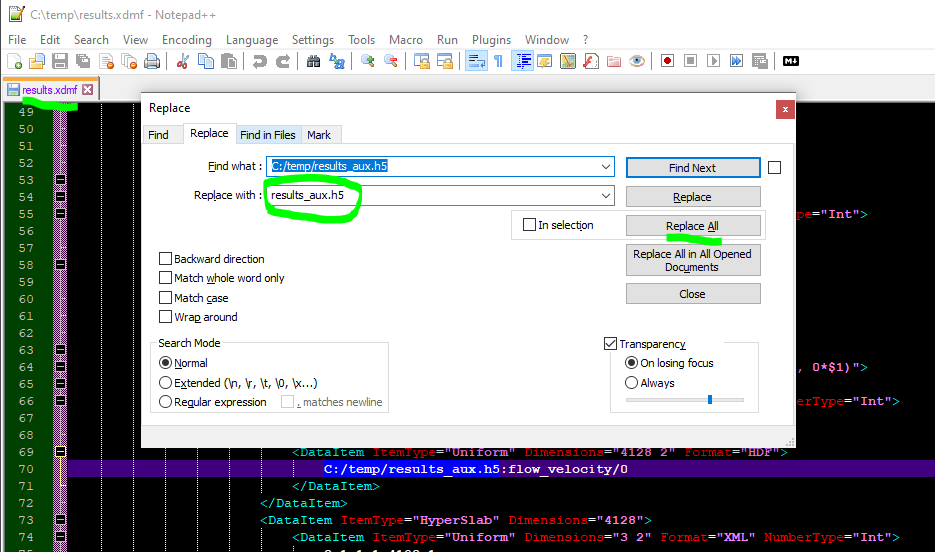

BASEMENT
========

Two-dimensional (2d) numerical simulation methods described on these pages use the freely available software *BASEMENT* 3.x, which is developed at the ETH Zurich in Switzerland . Visit their `website <https://basement.ethz.ch/>`__ to download the program and documentation. The here provided online material guides through a numerical simulation exercise with *BASEMENT v3.0.2*. The guidance describes:

-  Pre-process data: From point clouds to computational meshes
-   Set up and run a numerical simulation with BASEMENT v.3
-  Post-process simulation results: Visualize, understand and analyze the model output.
-  Calibration & validation is here only mentioned as an integral part of numerical studies.

.. admonition:: Requirements

   To complete the tutorial, the following software is needed (all software can be run on *Windows* and *Linux* platforms): \ **-**\ `BASEMENt v3.0.2 <https://basement.ethz.ch/>`__\ \ **-**\ `QGIS v3.16 <geo_software.html#QGIS>`__, and \ **-**\ `ParaView <https://www.paraview.org/>`__.

This tutorial uses *BASEMENT*\ ’s *BASEplane* module (version 3.0.2) to perform a two-dimensional (2d) hydrodynamic numerical simulation.

Pre-processing: Mesh Generation 
-------------------------------

Prepare a ``2dm`` mesh file as described in the `QGIS data pre-processing <QGIS-prepro.html>`__ section.

Steady 2d Simulation with BASEMENT 
----------------------------------

In addition to the mesh (``2dm`` file), the numerical engine of *BASEMENT* needs a model setup file (*model.json*) and a simulation file (*simulation.json*), which both are created automatically by *BASEMENT*. The following sections describe how to make *BASEMENT* creating the two *.json* files. Before getting there, create a new project folder of your choice (e.g., ``C:/BM/irme-exercise/``).


.. tip::
  The defined project folder directory must not contain any dots nor special characters nor spaces. Only use letters, numbers, \*_\* (underscore) or *-* (minus) in folder names." %}

Make sure to place the two input files in the folder:

-  The 2d mesh ``.2dm`` file (i.e., the *finalmesh.2d* from the `pre-processing <#prepro>`__).
-  A discharge inflow file (flat hydrograph) for the upstream boundary condition can be downloaded `here <https://github.com/hydro-informatics/materials-bm/blob/master/flows/SteadyVanillaInflow.txt>`__ (if necessary, copy the file contents locally into a text editor and 
   save the file as ``SteadyVanillaInflow.txt`` in the local project directory).

Setup the Model File
~~~~~~~~~~~~~~~~~~~~

This section walks you through the model setup of a hydrodynamic 2d *BASEMENT* simulation. The model setup is saved in a file called model.json.

Regularly save setting by clicking on the ``Write`` button (bottom-right corner).
-  Open *BASEMENT* and select the Scenario Directory. Then click on ``SETUP``, right-click and ``Add DOMAIN``.
-  Use the average elevation of each mesh triangle: ``GEOMETRY`` > ``Add item`` >
``Interpolation`` > select WEIGHTED (other options: MEDIAN, MAXIMUM, MINIMUM, MEAN).
-  ``GEOMETRY`` > ``MESH_FILE`` > select ``finalmesh.2dm``.
-  ``GEOMETRY`` > right-click > ``Add item REGIONDEF`` > ``Add item`` (5 times) and define the items as:

===== ======== ========== ========== ========== ======
INDEX 1        2          3          4          5
===== ======== ========== ========== ========== ======
NAME  riverbed lower_bank upper_bank floodplain street 
===== ======== ========== ========== ========== ======

The window should now look like this: 

.. figure:: ../../img/bm-mod-reg.png
   :alt: basement regions
   
   Region definitions.

-  Next, we need to define inflow and outflow boundary condition with ``stringdefs``. In the ``GEOMETRY`` section right-click – ``Add item`` ``STRINGDEF`` 
– ``Add item`` (2 times) and define item [0] as:  
	-   ``name`` = ``Inflow``   
	-   ``upstream_direction`` = ``right`` 
-  Define ``STRINGDEF`` item [1] as:  
	-   ``name`` = ``Outflow``   
	-   ``upstream_direction`` = ``right`` 
	
.. note::
   If you used `BASEmesh’s Stringdef tool <QGIS-prepro.html#stringdef>`__, the upstream direction must be defined as ``right``.

-  Add the initial condition in the ``HYDRAULICS`` section with by right-clicking > ``Add item`` > ``INITIAL`` (if not yet present) and set ``type``: “DRY (i.e., the river is dry at the beginning of the simulation).
-  Add upstream and downstream boundary conditions with a right-click on the ``HYDRAULICS`` section > ``Add item`` > ``BOUNDARY`` (if not yet present), then right-click on the new ``BOUNDARY`` section > ``Add item STand ARD`` > ``Add item`` (2 times)
-  Define BOUNDARY item [0] as:  
	-   ``discharge_file`` = ``C:/.../SteadyVanillaInflow.txt`` (select by clicking on the folder symbol that occurs when the field is activated)	  
	-   ``name`` = ``Inflow``   
	-   ``slope`` = 0.0056	  
	-   ``string_name`` = ``Inflow``   
	-   ``type`` = uniform_n`

-  Define BOUNDARY item [1] as:  
	-   ``name`` = ``Outflow``   
	-   ``type`` = ``zero_gradient_out`` (note: this is not a good choice in practice, where a `stage-discharge relation or rating curve <https://en.wikipedia.org/wiki/Rating_curve>`__ should be used for the downstream boundary condition)

-  Define a global `Strickler <https://en.wikipedia.org/wiki/Manning_formula>`__-based friction value of *kst*\ =30m1/3/s: In the ``HYDRAULICS`` section right-click > ``Add item FRICTION`` and define ``FRICTION`` with:
	-   ``default_friction`` = 30.0	  
	-   ``type`` = ``strickler`` 
-  Assign particular `Strickler <https://en.wikipedia.org/wiki/Manning_formula>`__ values with a right-click on ``regions`` and ``Add item`` (5 times). Then define the five regions items ([0] through [4]) as 

=============== ======== ========== ========== ========== ======
``friction``    28       15         20         40         85
=============== ======== ========== ========== ========== ======
``region_name`` riverbed lower_bank upper_bank floodplain street 
=============== ======== ========== ========== ========== ======

.. figure:: ../../img/bm-mod-frc.png 
   
    Assignment of friction (roughness) values to model regions.

-  In the ``PARAMETER`` section define:  
	-   ``CFL`` = ``0.95``   
	-   ``fluid_density`` = ``1000.0``   
	-   ``max_time_step`` = ``100.0``   
	-   ``minimum_water_depth`` =\ ``0.01`` 
-  Define a ``simulation_name`` (e.g., ``SteadyVanilla``)

Note that the definitions of ``PHYSICAL_PROPERTIES`` and ``BASEPLANE_2d`` are mandatory. Click on the ``Write`` button (bottom-right corner) to save the model setup (see image below). If everything is correctly set up, the ``Console`` tab will automatically open and the ``Error Output`` canvas is empty.


    
    Final model setup 

Setup the Simulation File
~~~~~~~~~~~~~~~~~~~~~~~~~

The simulation file in *BASEMENT* v.3.x is called *simulation.json* (different from previous versions of BASEMENT) and located in the same folder as model.json (model setup file). To setup the simulation file: -
In *BASEMENT* go to the ``SIMULATION`` Tab (situated in left window pane) and unfold the ``OUTPUT`` and ``TIME`` items.
-  Right-click on the ``OUTPUT`` item an ``Add item`` (5 times). Then define exactly in that irder (important for results export later on): \* [0] = ``water_depth`` \* [1] = ``water_surface`` \* [2] = ``bottom_elevation`` \* [3] = ``flow_velocity`` \* [4] = ``ns_hyd_discharge``
-  Define the TIME item as: \* ``end`` = ``5000.0`` \* ``out`` = ``200.0`` \* ``start`` = ``0.0`` The *BASEMENT* window should now look like this:


    
    The Simulation tab setup. In order to export results with *BASEMENT*\ ’s Python scripts, the OUTPUT parameters must be defined in exactly that order.

Run the simulation
~~~~~~~~~~~~~~~~~~

After the successful simulation setup, select an appropriate ``Number of CPU cores`` (bottom-right in the above figure). If a high-quality graphics card with a powerful GPU is available, the GPu (high-performance hardware) has a much faster performance. Otherwise (no powerful GPU available), do not select GPU because it may significantly slow down the simulation speed. For faster simulations, select ``Single`` precision (bottom-right in the above figure), but in this example, ``Double`` precision will work sufficiently fast as well. Click on the ``Run`` button to start the simulation and wait for approximately 2-10 minutes. *BASEMENT* will prompt the simulation progress, while the ``Error Output`` canvas should remain white (see below `figure <#bm-sim-end>`__). If any error occurs, go back to the above sections (or even to the mesh generation) and fix error message issues.


    
    *BASEMENT* after successful simulation.

Export results
~~~~~~~~~~~~~~

Once the simulation successfully finished, go to *BASEMENT*\ ’s ``Results`` tab and make sure that the ``xdmf`` output format is defined. Then click on the ``Export`` button (see also below `figure <#bm-res-exp>`__). *BASEMENT* will inform about the export success.

.. figure:: ../../img/bm-res-exp.png 
    
    Export results after successful simulation.

| *BASEMENT*\ ’s developers at the ETH Zurich provide a suite of `Python   scripts <http://people.ee.ethz.ch/~basement/baseweb/download/tools/python-scripts/>`__   for post-processing the simulation results. Here, we need the Python script ```BMv3NodestringResults.py`` <http://people.ee.ethz.ch/~basement/baseweb/download/tools/python-scripts/BMv3NodestringResults.py>`__ (`click to download <http://people.ee.ethz.ch/~basement/baseweb/download/tools/python-scripts/BMv3NodestringResults.py>`__).
| To run the Python script, a Python3 installation with the ``numpy`` and ``h5py`` packages is required. To learn more about the installation and usage of Python, have a look at the `instructions on this website to install Python <hy_install.html>`__. Note that working   with the provided Python file requires that the output variables must   be exactly defined as shown in the above `figure <#bm-sim-set>`__ of *BASEMENT*\ ’s ``SIMULATION`` tab.

Post-processing with ParaView
-----------------------------

*ParaView* is a freely available visualization software, which enables plotting *BASEMENT* v.3.x results in the shape of ``xdmf`` (*eXtensible Data Model and Format*) files. Download and install the latest version of *ParaView* from their `website <https://www.paraview.org/download/>`__, if not yet done.

Load BASEMENT Results
~~~~~~~~~~~~~~~~~~~~~

Open *ParaView* and click on the folder icon (top left of the window) to open the simulation results file (``results.xdmf``). *ParaView* might ask to choose an appropriate XMDF read plugin. Select ``XDMF Reader`` here and click ``OK``:

To explore the model results:
-  Select variables (e.g., ``flow_velocity``, ``water_depth``, or ``water_surface``) in *ParaView*\ ’s ``Cell Arrays`` canvas (green-highlighted circle in the below `figure <#pv-vis>`__).
-  Click the ``Apply`` button (red-highlighted circle in the Properties tab in the below `figure <#pv-vis>`__). All variables are now loaded and can be plotted.
- To plot a variable, select one (e.g., ``flow_velocity``) in the toolbar (light-blue-highlighted circle in the upper part of the below `figure <#pv-vis>`__). Then click the play button in the toolbar (dark-blue-highlighted circle around the green arrow in the upper part of the below `figure <#pv-vis>`__) to cycle through the time steps.

.. figure:: ../../img/pv-vis.png
    
    ParaView after successful import of the model results (results.xdmf) -  see above descriptions.

All available time steps are listed in the Blocks tab (bottom-left in Figure 1). Anything should be visible at the beginning because the initial conditions were defined as ``dry`` (see the setup of `inital conditions <#init>`__ ). The above `figure <#pv-vis>`__ shows the last time step (``Timestep[25]``), with water flowing at a peak velocity of 3.7 m/s. The 25 available time steps result from the definition made in *BASEMENT*\ ’s ``SIMULATION`` tab with a total duration of 5000.0 and an output step of 200.0. Note that the time units have no dimension here because they correspond to computational time steps.

Export Visualizations
~~~~~~~~~~~~~~~~~~~~~

The animations can be saved as movie (e.g., ``avi``) or image (e.g., ``jpg``, ``png``, ``tiff``) files via ``File`` > ``Save Animation...``. The current state (variable, ``Timestep[i])`` can be saved as ``pvsm`` file via ``File`` > ``Save State File``. The state file can also be saved as Python script for external execution and implementation in `Python programs <hy-install.html>`__.

Export Data
~~~~~~~~~~~

For geospatial calculations (e.g., calculate `habitat suitability indices for target fish species <https://riverarchitect.github.io/RA_wiki/SHArC>`__ based on flow velocity and water depth), the simulation results must be converted to geospatial data formats. The first conversion step is to extract relevant point data in *ParaView*:

1. With the ``results.xdmf`` file opened in *ParaView*, right-click on ``results.xdmf`` in the ``Pipeline Browser``, then ``Add Filter`` > ``Alphabetical`` > ``Cell Centers``.
2. With the ``CellCenters1`` filter enabled in the ``Pipeline Browser`` (blue-highlighted circle in the `figure below <#pv-exp-steps>`__), set the ``Time`` in the menu bar to the end time step (here: ``5000``, i.e., step no. ``25``, see the red-highlighted circle in the `figure below <#pv-exp-steps>`__)).
3. In the ``Properties`` tab (green-highlighted circle in the `figure below <#pv-exp-steps>`__), check the ``Vertex Cells`` box, and click the ``Apply`` button.
4. Press ``CTRL`` + ``S`` on the keyboard > a ``Save File`` dialogue window opens:  

	-   Navigate to the folder where you want to save the data   
	-   Enter a ``File name`` (e.g., *bm-steady-vanilla*)  
	-   In the ``Files of type`` drop-down field, select ``Comma or Tab Delimited Files(*.csv *.tsv *.txt)``   
	-   Click ``OK`` 

5. The ``Configure Writer (CSVWriter)`` window opens. Make sure that ``Point Data`` is selected as ``Field Association``. Optionally, check the ``Choose Arrays To Write`` box and select relevant fields only. Press the ``OK`` button.

The point data export is now complete. The next step is to import the data (here: *bm-steady-vanilla.csv*) in *QGIS* (`next section <#QGIS-import>`__).


    
    The CellCenters (dark-blue circle) filter in ParaView, with the maximum Time step setting (red circle) and the Properties definitions (green circle).

Post-processing with QGIS
-------------------------

.. tip::
   Ensure that the `Crayfish plugin <geo_software#plugins>`__ is correctly installed and available in the *Toolbox*.

There are two (to three) options to import the results in *QGIS*:

1. `Use ParaView Outputs <#pv-exp-steps>`__ 
2. `Modify ``results.xdmf`` and directly import results in QGIS <#qigs-imp-steps>`__ 
3. `Use an import tool (currently only available on demand ) <#schmalzl>`__ 

Use *ParaView* export (here: *bm-steady-vanilla.csv*)
~~~~~~~~~~~~~~~~~~~~~~~~~~~~~~~~~~~~~~~~~~~~~~~~~~~~~

After data export from *ParaView*:
-  In *QGIS*, click on the ``Layer`` menu > ``Add Layer`` > ``Add Delimited Text Layer...``. 
.. figure:: ../../img/QGIS-add-lyr.png
   :alt: bmx	
    Open the Add Delimited Text Layer import wizard.

-  The ``Data Source Manager | Delimited Text`` window opens (`see figure below <#QGIS-import-csv>`__)
-  In the ``File name`` field select *bm-steady-vanilla.csv*
-  Enter a ``Layer name`` (e.g., *bm-steady-vanilla-csv*)
-  In the ``File Format`` canvas, check the ``CSV (comma separated values)`` box
-  In the ``Record and Field Options`` canvas, activate the ``First record has field names`` checkbox
-  In the ``Geometry Definition`` canvas, define the ``Point Coordinates`` as ``X field`` = ``Points:0``, ``Y field`` = ``Points:1`` and ``Z field`` = ``Points:2`` (verify the correctness:
   ``X``-data should be in the order of 4.2 to 4.4·106, ``Y``-data should be in the order of 5.5·106, and ``Z``-data should be in the order of 100.0 to 200.0)
-  Set the ``Geometry CRS`` to the ``Project CRS`` (``ESRI:31493 - Germany_Zone_3``).
-  Click the ``Add`` and the ``Close`` buttons on the bottom of the window. The points should now be plotted in the main *QGIS* window.

.. figure:: ../../img/QGIS-import-csv.png
   
    The Data Source Manager: Delimited Text window with required settings highlighted with the green marker.

Use the ``results.xdmf`` file directly(**recommended for geospatial data conversion**)
~~~~~~~~~~~~~~~~~~~~~~~~~~~~~~~~~~~~~~~~~~~~~~~~~~~~~~~~~~~~~~~~~~~~~~~~~~~~~~~~~~~~~~

Modify ``results.xdmf`` and directly import model result in *QGIS*: 
-  Open ``results.xdmf`` in a text editor (e.g.,   `Notepad++ <hy_others.html#npp>`__)
-  Use the find-and-replace tool (``CTRL`` + ``H`` keys in *Notpad++*) to remove file paths before ``results_aux.h5`` in the document (otherwise *QGIS* will crash later on - `read more in BASEMENT\ ’s User Forum <http://people.ee.ethz.ch/~basement/forum/viewtopic.php?id=5261>`__). 
-  For example: ``Find what`` = ``C:/temp/results_aux.h5`` (pay   attention to use ``/`` rather than ``\``) and ``Replace with`` = ``results_aux.h5`` (see `below figure <#npp-xdmf-replace>`__). After having removed all path occurrences in the document, save and close   ``results.xdmf``. 


      
    Find the string results_aux.h5 in results.xdmf and remove the file directories.

-  If not yet done, load the mesh file   (here: ```finalmesh.2dm`` <QGIS-prepro.html#2dm>`__) by clicking on   *QGIS*\ ’ ``Layer`` menu > ``Data Source Manager`` > ``Mesh`` tab and select ``finalmesh.2dm``.
-  In *QGIS*\ ’ ``Layers`` window,   double-click on the ``finalmesh`` layer to open the ``Layer Properties`` window.
-  In the ``Layer Properties`` window, go   to ``Source`` > click on ``Assign Extra Data Set to Mesh`` and choose ``results.xdmf`` 

.. figure:: ../../img/QGIS-assign-meshdata.png
   
    Assign mesh data to the computational mesh.

-  After import, double-click on the new ``results`` layer to open the ``Symbology`` (``Layer Properties``) and select a variable to represent from the ``Groups`` canvas. Make sure to enable the contour plot (right side in the `below figure <#QGIS-meshdata-u>`__) symbol, select the timestep to plot (for steady-state simulation, select the last timestep), optionally go to the ``Contours`` ribbon to change the color pattern (upper-most green circle in the `below   figure <#QGIS-meshdata-u>`__), and click ``Apply``. 

.. figure:: ../../img/QGIS-meshdata-u.png
   
    Illustrate the flow velocity with QGIS’ Layer Properties > Symbology controls. The green circles highlight settings for the last timestep of a steady-state simulation.
  
.. figure:: ../../img/QGIS-meshdata-u-plotted.png
   
    After application of the above Symbology settings: The flow velocity is illustrated in red-shades.

Thanks to Matthias Bürgler who helped with instructions in the `BASEMENt user forum <http://people.ee.ethz.ch/~basement/forum/viewtopic.php?pid=6095#p6095>`__.

Klaus Schmalzl’s ``Basement_post_W.exe`` 
~~~~~~~~~~~~~~~~~~~~~~~~~~~~~~~~~~~~~~~~

Another option in the future will be `Klaus Schmalzl’s ``Basement_post_W.exe`` <http://people.ee.ethz.ch/~basement/baseweb/users-meetings/30-01-2020/6_Schmalzl.pdf>`__, which is currently only available on demand.

Convert results to geospatial formats (SHP and TIF)
~~~~~~~~~~~~~~~~~~~~~~~~~~~~~~~~~~~~~~~~~~~~~~~~~~~

To analyze the imported results, they need to be converted to geo-spatial data format such as `ESRi Shapefiles <https://en.wikipedia.org/wiki/Shapefile>`__ or `GeoTIFF <https://en.wikipedia.org/wiki/GeoTIFF>`__ rasters. There are two options available depending on how data were imported:

1. Conversion with the *Crayfish* plugin after `direct import of ``results.xdmf`` <#QGIS-imp-steps>`__ (recommended)
2. Conversion of `ParaView exports <#pv-conv>`__ (not recommended)

Conversion with the Crayfish plugin (recommended)
^^^^^^^^^^^^^^^^^^^^^^^^^^^^^^^^^^^^^^^^^^^^^^^^^

Open the *Crayfish* plugin’s ``Rasterize`` tool from *QGIS*\ ’ ``Processing`` menu > ``Toolbox`` > ``Crayfish`` > ``Rasterize`` (see figure below).

.. figure:: ../../img/QGIS-crayfish-installed.png
   
    Open the Rasterize tool of the Crayfish plugin.

In the ``Rasterize`` window make the following settings (see also `figure below <#QGIS-crayfish-exp>`__):  
-   ``Input mesh layer`` = ``finalmesh``   
-   ``Minimum extent to render (xmin, xmax, ymin, ymax)`` = click on the ``...`` button and select the ``Layer`` option (choose ``finalmesh``)  
-   ``Map units`` = ``0.1`` (can also be larger -  the larger this number, the coarser the output *tif*)  
-   ``Dataset group`` = ``flow_velocity`` (or whatever variable should be in the final *tif* -  note that rasters can/should have only one value per pixel)  
-   ``Timestep`` = ``208 days, 8:00:00`` (last timestep in the case of steady-state simulations)
-   ``Output layer`` = ``C:\ ... \u.tif`` (or whatever variable raster specifier applies)
-  Click ``Run`` 

.. figure:: ../../img/QGIS-crayfish-exp.png
   
    Settings to be made in Crayfish’s Rasterize tool.

With a ``Singleband pseudocolor`` > ``Spectral`` ``Symbology``-selection in the ``Layer Properties``, the *QGIS* window should now look like this:

.. figure:: ../../img/QGIS-crayfish-final.png
   
    A Singleband pseudocolor (Layer Properties > Symbology) selection will represent the velocity distribution in the final velocity GeoTIFF.

Conversion of ParaView exports (not recommended)
^^^^^^^^^^^^^^^^^^^^^^^^^^^^^^^^^^^^^^^^^^^^^^^^

-  In *QGIS*, right-click the above imported csv-points layer (here: ``bm-steaedy-vanilla-csv``) > ``Export`` > ``Save Features As...``
-  The ``Save Vector Layer as...`` window opens (`see figure below <#QGIS-exp-sim-pts>`__), where the following settings need to be defined:
	-   ``Format`` = ``ESRI Shapefile``   
	-   ``File name`` = for example ``C:\...\bm-vanilla-pts.shp``   
	-   ``CRS`` = ``ESRI:31493 -  Germany_Zone_3``   
	-   In the ``Encoding``\ canvas, deactivate the ``ns_hyd_discharge``, ``Points:0``, ``Points:1``, and ``Points:2`` fields   
	-   In the ``Geometry`` canvas, set the ``Geometry type`` to ``Point`` and active ``Include z-dimension``   
	-   Check the ``Extent (current: layer)`` box 
-  Click ``OK`` 

.. image:: ../../img/QGIS-exp-sim-pts.png
   
    The Save Vector Layer As… window with required settings highlighted (green marker).

| Next, the point shapefile needs to be converted to a   `GeoTIFF <https://en.wikipedia.org/wiki/GeoTIFF>`__ raster format to enable further data analyses. Therefore: 
	-  In *QGIS* ``Raster`` menu,   click on ``Conversion`` and select ``Rasterize (Vector to Raster)``
	-  In the ``Rasterize (Vector to Raster)`` window define: \*   ``Input layer`` = ``bm-vanilla-pts`` \* For ``Field to use for a burn-in value``, select one target value, for example: ``water_depth`` (note: rasters can have only one value per   pixel)
| \* Do not assign any value in the ``A fixed value to burn`` field \* ``Output raster size units`` = ``Pixels`` \* ``Width/Horizontal resolution`` = ``5.0`` \* ``Height/Vertical resolution`` = ``5.0`` \* ``Output extent (xmin, xmax, ymin, ymax)``: Click on the ``...`` button and select *Use Layer extent* > *Use extent from* ``bm-vanilla-pts`` \* Below the *Advanced parameters* canvas, define a raster output directory and name (e.g., ``vanilla-depth.tif``) 
-  Click ``Run``.

.. figure:: ../../img/QGIS-make-tiff.png
   
    The Rasterize (Vector to Raster) window with required settings highlighted (green marker).

.. tip::
   Facilitate the conversion of geospatial data with efficient *Python* algorithms (see the `geospatial Python <geo-python.html>`__ section). Many *Python* conversion routines are also efficiently accessible and tailored for river analysis in the `flusstools <https://flusstools.readthedocs.io/>`__ package.

Result interpretation
---------------------

In *ParaView* (renders faster) or *QGIS*, look at all variables (``flow_velocity``, ``water_depth``, and ``water_surface``), explore their evolution over time, different coloring and answer the following questions:

-  Are the results are in a physically reasonable and meaningful range?
-  When did the simulation become stable?\ *To save time, the simulation duration can be shortened (*\ BASEMENT\ *’s ``SIMULATION`` tab), down to the time step when stability was reached.*
-  Are there particularities such as rapids that correspond (qualitatively) to field observations (are rapids on confinements and /or terrain drops)?
-  Zoom into the `final tif raster <#QGIS-crayfish-final>`__ and have a look at the triangulation artifacts. The artifacts are not realistic. How can the problem be addressed?

After post-processing, the model still needs to be `calibrated and validated <calibration.html>`__ before it can be used for scientific or engineering purposes in river ecosystem analyses.
